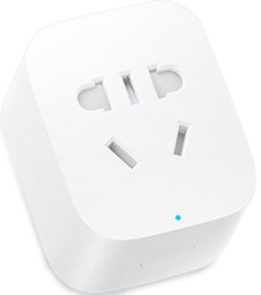
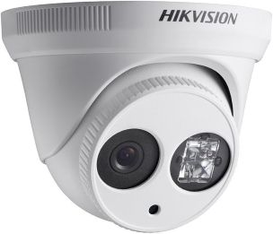

# alpaca-switch

Unified ASCOM Alpaca Switch driver that exposes multiple hardware backends as a single Switch device to astronomy software such as N.I.N.A.

Currently supports two backends, all visible as numbered switches inside one ASCOM device:

| Backend | Hardware | Protocol |
|---------|----------|----------|
| **Xiaomi Mi**  | Mi Smart Plug (Wi-Fi power switches) | Xiaomi UDP protocol, AES-CBC encryption |
| **Hikvision**  | IP camera IR illuminators | Hikvision ISAPI over HTTP, Digest auth |

Switch IDs are assigned in the order backends are listed: Mi plugs first (IDs 0–N), then Hikvision cameras (IDs N+1–M).

## Requirements

- Go 1.22 or later
- **Xiaomi Mi plugs:** device IP and 32-character hex token (obtainable with [miio](https://github.com/rytilahti/python-miio))
- **Hikvision cameras:** camera IP, admin credentials, and *Configuration → System → Maintenance → System Service → Hardware* enabled in the camera web UI
  - Tested on: DS-2CD2343G0-I, DS-2CD2335-I
  - Supports optional port in host field, e.g. `"192.168.1.3:65005"`

## Quick Start

### 1. Configure

Copy `config/settings.json.example` to `config/settings.json` and fill in your device details:

```json
{
    "alpaca_port": 11111,
    "mi_devices": [
        {
            "ip": "192.168.1.100",
            "token": "your32hexcharactertoken00000000",
            "name": "Switch 1",
            "customname": "12V Power",
            "min": 0,
            "max": 1,
            "step": 1,
            "canwrite": true,
            "value": 0
        }
    ],
    "hikvision_cameras": [
        {
            "host": "192.168.1.4",
            "username": "admin",
            "password": "yourpassword",
            "name": "Backyard IR",
            "uniqueid": "00000000-0000-0000-0000-000000000001",
            "value": 0
        }
    ]
}
```

Add as many entries to each array as needed.

### 2. Build

```bash
go build -o alpaca-switch.exe .
```

### 3. Run

```bash
./alpaca-switch.exe
```

The driver listens on port **11111** (standard ASCOM Alpaca port) and responds to ASCOM discovery broadcasts on UDP port **32227**.

### 4. Connect from N.I.N.A.

1. Open N.I.N.A. → Equipment → Switch
2. Select **ASCOM Alpaca** from the driver list
3. Click **Discover** (or enter Host `localhost` and Port `11111` manually)
4. Select **Alpaca Switch Controller** from the list
5. Click **Connect** — all switches appear by name

## Configuration reference

### Top-level

| Field | Description |
|-------|-------------|
| `alpaca_port` | HTTP API port (default: `11111`) |
| `mi_devices` | Array of Xiaomi Mi smart plug configs |
| `hikvision_cameras` | Array of Hikvision camera configs |

### Xiaomi Mi device fields

| Field | Description |
|-------|-------------|
| `ip` | Device IP address |
| `token` | 32-character hex authentication token |
| `name` | Default device name |
| `customname` | Title shown in NINA (overrides `name` if set) |
| `description` | Subtitle shown in NINA (optional; falls back to `customname` or `name`) |
| `min` / `max` / `step` | Value range (0/1/1 for on/off switches) |
| `canwrite` | `false` to make the switch read-only in NINA |
| `value` | Cached last-known state (0=off, 1=on) |

### Hikvision camera fields

| Field | Description |
|-------|-------------|
| `host` | Camera IP address, optionally with port: `"192.168.1.4"` or `"192.168.1.3:65005"` |
| `username` | Camera admin username (usually `admin`) |
| `password` | Camera password |
| `name` | Title shown in NINA |
| `description` | Subtitle shown in NINA (optional; falls back to `"<name> IR illuminator"`) |
| `uniqueid` | Stable UUID for the ASCOM device (any unique value, e.g. `"00000000-0000-0000-0000-000000000001"`) |
| `value` | Cached last-known IR state (0=off, 1=on) |

## Project structure

```
alpaca-switch/
├── main.go                        # Entry point: loads config, wires backends, starts server
├── backend/
│   ├── backend.go                 # SwitchBackend interface + Router (ID mapping)
│   ├── mi/
│   │   ├── mi.go                  # Xiaomi Mi plug state management
│   │   └── xiaomi.go              # Xiaomi UDP protocol (AES-CBC encrypted)
│   └── hikvision/
│       └── hikvision.go           # Hikvision ISAPI IR control (HTTP Digest auth)
├── server/
│   ├── api.go                     # HTTP server, request helpers, response builder
│   ├── discovery.go               # ASCOM Alpaca UDP discovery (port 32227)
│   ├── management.go              # /management/* endpoints
│   ├── common.go                  # /api/v1/switch/0/connected, name, description…
│   ├── switch.go                  # /api/v1/switch/0/getswitch, setswitch…
│   └── types.go                   # ASCOM Alpaca response structs
└── config/
    ├── settings.json              # Your local config (excluded from git — contains credentials)
    └── settings.json.example      # Safe template to commit
```

## Adding a new backend

1. Create `backend/<name>/<name>.go` implementing the `backend.SwitchBackend` interface
2. Add a config struct and load it in `main.go`
3. Pass the new backend to `backend.NewRouter()`

## Notes

- `config/settings.json` is excluded from git because it contains device tokens and camera passwords. Commit `settings.json.example` instead.
- Hikvision IR state is read live from the camera each time NINA polls `GetSwitch`.
- Xiaomi plug state is read live on `Connect` and cached; updates are sent on each `SetSwitch`.
- Discovery binds to the primary outbound network interface to avoid NINA discovering the driver multiple times on multi-adapter machines.

## References

- [ASCOM Alpaca API Reference](https://github.com/ASCOMInitiative/ASCOMRemote/blob/main/Documentation/ASCOM%20Alpaca%20API%20Reference.pdf)
- [Hikvision ISAPI Documentation](https://www.hikvision.com/en/support/download/sdk/)
- [python-miio (Xiaomi token extraction)](https://github.com/rytilahti/python-miio)
